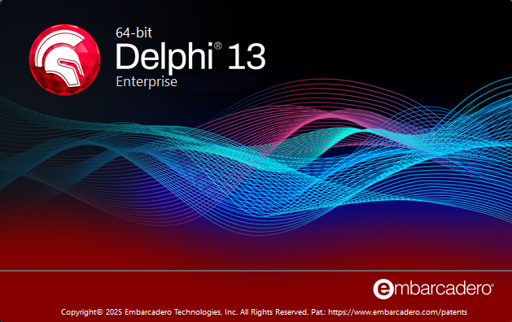

Delphi 13 Florence is the latest major release of our namesake's IDE and has several new features including the language's very first ternary operator!

<!--more-->

You may have seen the announcement, attended the webinar, read the "[What's New](https://www.embarcadero.com/products/rad-studio/whats-new-in-13-florence)" page, and perhaps even downloaded it yourself. In any case, come to this month's meeting to see demos and hear more about Delphi 13 Florence and why it was named that. Learn about the greater presence of the 64-bit IDE, the new `NameOf()` function, and WebBroker's session management addition. And, of course, see the new `if` ternary assignment operator!

## DATE/TIME ##

Wednesday, September 17, 2025
6:00 - 8:00 PM

## LOCATION ##

**Olive Garden in Lake Oswego**  
[6355 SW Meadows Rd.  
Lake Oswego, OR 97035](https://www.olivegarden.com/locations/or/lake-oswego/lake-oswego/1394)  
(503) 684-3160